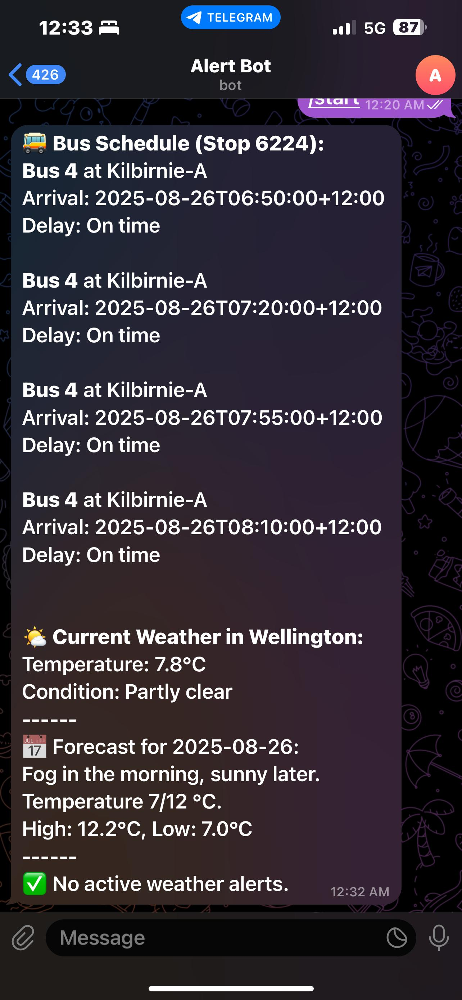

# Wellington Bus & Weather Telegram Alerts using AWS Lambda

This project provides **automated Telegram alerts** for bus arrivals and daily weather in Wellington, NZ, using **AWS Lambda**. There are two types of alerts:

1. **Morning Alert (7:30 AM NZST)** – Provides both **bus schedule** and **daily weather forecast**.  
2. **Evening Alert (15 min prior to shift end)** – Provides **bus schedule only** (no weather) for convenient planning after work.

---

## Motivation

Managing transport in Wellington can be tricky, especially on weekends.

During weekdays, buses run frequently, every 15–30 minutes, so missing one is rarely a big issue. Alerts in the morning or evening are helpful but not critical.

However, during weekends (Saturday & Sunday), things are different. Buses run less often, typically every 45–60 minutes. Some services may be cancelled, and others might arrive earlier than scheduled. This can be frustrating: while early arrivals might help some people reach home faster, for others it is annoying if they are okay waiting a little longer. Arriving 5–10 minutes early at the stop can easily cause a missed bus.

The morning alert gives an overview of the next buses and the weather forecast to plan the day.

The evening alert, sent 15 minutes before the end of a shift, ensures you know the next 4 buses, helping avoid missed rides home. This is particularly valuable on weekends when buses are sparse and timing is crucial.

By automating these alerts, we reduce the stress of checking schedules manually and help plan trips efficiently, especially when time-sensitive shifts and irregular weekend schedules come into play.

---

## Features

- **Morning Alert**  
  - Fetches top 4 buses (services 4 or 38x) for stop 6224  
  - Shows **aimed arrival times** and **delay**  
  - Fetches **current weather** and **next 24-hour forecast**  
  - Sends a **formatted Telegram message**

- **Evening Alert**  
  - Fetches top 4 buses (services 4 or 38x) for stop 6224 (Where I live!)  
  - Sends **bus arrival times only** to Telegram

---

## Setup

### 1. AWS Lambda

- Runtime: **Python 3.11**
- Timeout: **10–15 seconds**
- Memory: 128 MB

### 2. Environment Variables

Set these in Lambda for **both functions**:

| Variable            | Purpose                           |
|--------------------|----------------------------------|
| `TELEGRAM_TOKEN`     | Telegram Bot API token            |
| `TELEGRAM_CHAT_ID`   | Your chat ID                     |
| `METLINK_API_KEY`    | Metlink API key                  |
| `METEO_API_KEY`      | Meteosource API key (only morning Lambda) |

### 3. EventBridge Schedule

- **Morning alert** → 7:30 AM NZST  

cron(30 19 * * ? *)

- **Evening alert** → 15 minutes prior to end of work shift (adjust hours)  

> Remember: NZST = UTC +12 hours.

---

## Usage

1. Deploy each Lambda function separately.
2. Add the environment variables in the Lambda console.
3. Configure EventBridge rules for the appropriate time.
4. Ensure Telegram bot is created and your chat ID is correct.

---

## Example Morning Alert Output
 
